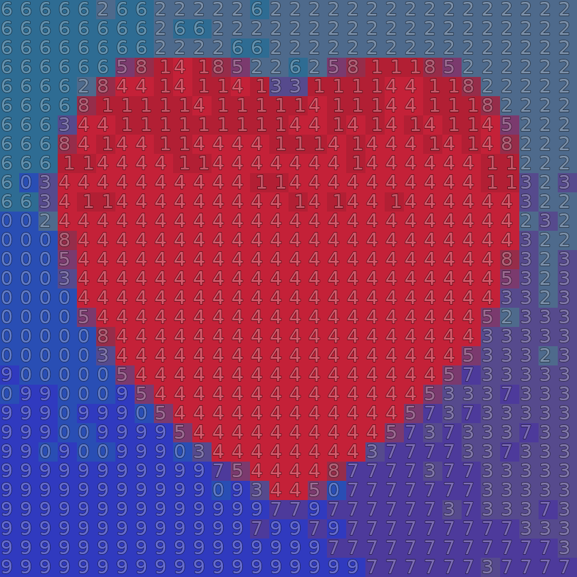

# prime-number-portrait

[](https://github.com/lijuno/prime-number-portrait/actions/workflows/ci.yml)

Turn a photo into a **prime portrait**: a picture whose pixels are the digits of a
(very probably) prime number. Read the digits row by row and you get one huge
integer that passes 40 rounds of the Miller–Rabin primality test.

| Input | Prime portrait |
| :---: | :---: |
|  |  |

The portrait on the right is a 900-digit probable prime.

## How it works

1. The photo is downscaled so that every remaining pixel becomes one digit.
2. Its colors are quantized to at most 10 clusters with k-means; each cluster
   is assigned a digit 0–9.
3. The digit grid, read row-major, is one large integer. Random noise is added
   before quantization (and a few cells are flipped to their second-closest
   color) so every attempt yields a slightly different number — the first digit
   is forced nonzero and the last digit odd.
4. Candidates are tested for primality with Miller–Rabin across all CPU cores
   until one passes. By the prime number theorem, a random n-digit odd number
   is prime with probability about 1/n, so a 900-digit portrait needs on the
   order of a few hundred attempts.
5. The winning grid is rendered as digits over the quantized colors.

## Install

Requires Python 3.10+.

```bash
git clone https://github.com/lijuno/prime-number-portrait
cd prime-number-portrait
pip install .
```

## Usage

```bash
prime-portrait yourphoto.jpg
```

This writes `yourphoto-prime.png` next to the input and prints the prime.
Useful options:

```text
--resize-factor N   divide each image side by N; one digit per remaining pixel
                    (default 16 — a 4000x3000 phone photo becomes a 250x187
                    grid, i.e. a 46,750-digit number; see the note below)
--clusters N        number of colors/digits, 2-10 (default 10)
--threads N         worker processes (default: all CPUs)
--trials N          Miller-Rabin rounds (default 40; error probability <= 4^-N)
--font PATH         TrueType font for the digits (auto-detected by default)
--cell-size N       output pixels per digit cell (default 32)
--output PATH       output PNG path
--seed N            make quantization and search reproducible
--show              open the result in an image viewer when done
```

**Start small.** Search time grows quickly with digit count: each Miller–Rabin
round on an n-digit number costs roughly O(n³) bit operations and the expected
number of attempts grows linearly with n too. A few hundred digits takes
seconds, a thousand digits takes seconds-to-minutes, and tens of thousands of
digits can take days. For a phone photo, try `--resize-factor 64` first and
work your way down.

The example above was produced with:

```bash
python examples/make_sample.py   # generates examples/sample.png
prime-portrait examples/sample.png --resize-factor 12 --seed 42
```

## A note on "probably" prime

Miller–Rabin is a probabilistic test: a composite number survives 40 rounds
with probability at most 4⁻⁴⁰ ≈ 10⁻²⁴ — far below the odds of a hardware
error. Proving primality of numbers this large (e.g. with ECPP) is a much
bigger computation; probable primes are the standard currency for recreational
mathematics of this kind.

## Credits

- Original inspiration: the [Lex Fridman podcast with Grant Sanderson
  (3Blue1Brown)](https://www.youtube.com/watch?v=ndMahzDCH1Y).
- The approach follows Ruud Meertens' [prime_portraits](https://github.com/rmeertens/prime_portraits)
  and his blog post [Painting by Prime Number](http://www.pinchofintelligence.com/painting-by-prime-number/),
  which in turn builds on ["Prime Portraits" (Bridges 2016)](http://archive.bridgesmathart.org/2016/bridges2016-359.pdf)
  by Zachary Abel. This repository is an independent reimplementation.
- Background reading and development notes live in [NOTES.md](NOTES.md).

## License

[MIT](LICENSE)
